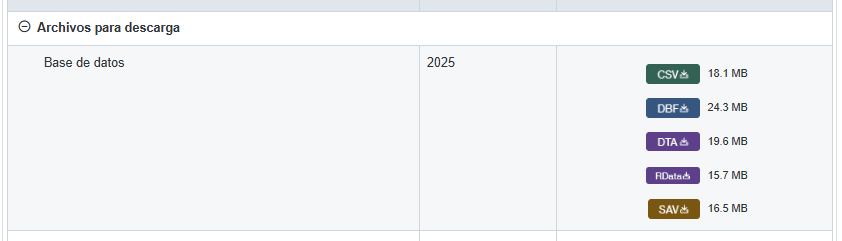
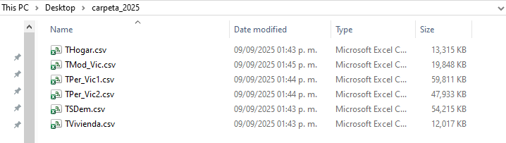
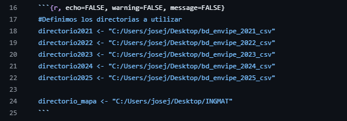
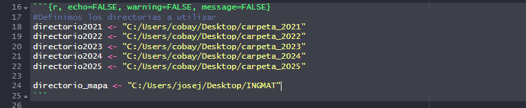
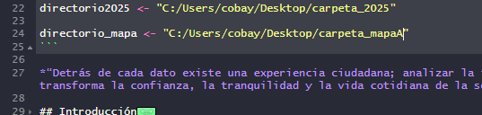

# Estadistica descriptiva de la Encuesta Nacional de Victimizacion y Percepcion Seguridad Publica
El documento obtenido, brinda 10 preguntas planteadas y que posteriormente se contestarón con la Encuesta, con datos cuantitativos, que fueron analizados con estadistica descriptiva utilizando el software RStudio. Para obtener el documento se uso el formato RMarkdown.  

## Obtencion de bases de datos
Para obtener los datos para que funcione el codigo RMarkdown, se descargan la base de datos por el sitio oficial de INEGI en la sección de la ENVIPE, en la pestaña microdatos: https://www.inegi.org.mx/programas/envipe/2025/#microdatos

Posteriormente se descarga el archivo .CSV.

Al terminar de descargar el archivo .zip, se hace una carpeta que contenga los datos descargados que corresponden a un año, por ejemplo "carpeta_2025", y se extraen los archivos contenidos en el ZIP en la carpeta dicha:

Posteriormente en el archivo "ProyectoFinal.Rmd" se coloca la direccion de la carpeta "carpeta_2025" para el directorio "directorio2025", de la misma manera para los años restantes, se descarga la base de datos del año que corresponde y se repite el proceso: 

En la sección asset descarga el archivo "qro.csv" en el que se obtiene el mapa, de igual manera se copia la direccion de la carpeta en el que se encuentra almacenado el archivo "qro.csv" y se pone la direccion en las comillas del directorio: "directorio_mapa"

